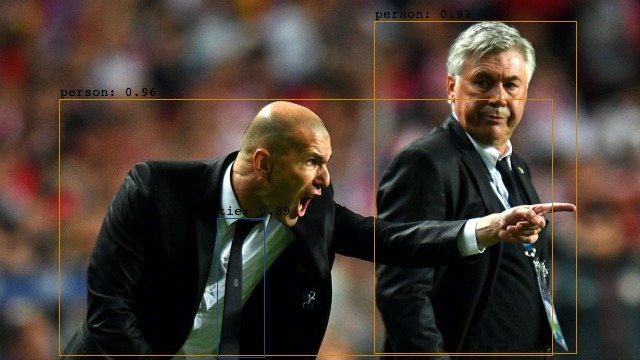
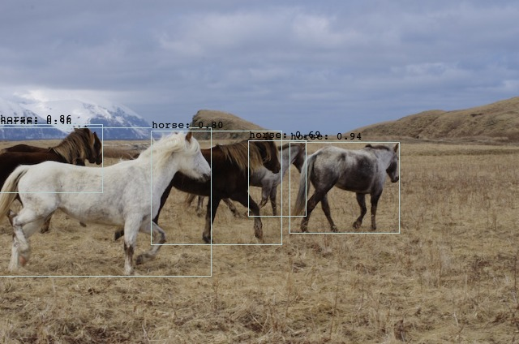

# YOLOv7.jl
[![][action-img]][action-url] [![][codecov-img]][codecov-url]

[action-img]: https://github.com/gabrielpreviato/YOLOv7.jl/workflows/CI/badge.svg
[action-url]: https://github.com/gabrielpreviato/YOLOv7.jl/actions
[codecov-img]: https://codecov.io/gh/gabrielpreviato/YOLOv7.jl/branch/main/graph/badge.svg?token=N1RL2BTV4C
[codecov-url]: https://codecov.io/gh/gabrielpreviato/YOLOv7.jl

This package is a Julia version of the YOLOv7 model based on the [original author implementation in PyTorch](https://github.com/WongKinYiu/yolov7).
## To Do

There is still some things to be done, collaboration is appreciated from anyone.

- [ ] Compare with Python YOLOv7
- [ ] Add basic training loop
- [ ] Add data loading
- [ ] Add data preprocessing and augumentation
- [ ] Add more models

And more...

## Inference

YOLOv7.jl provide one constructor that loads pre-trained weights that were made available by the [original author implementation in PyTorch](https://github.com/WongKinYiu/yolov7).

Currently we only support loading the "standard" version of YOLOv7.

```julia
using YOLOv7, Flux

model = yolov7_from_torch()
testmode!(m, true)

#
#   LOADING DATA ...
#

ŷ = model(x)
```

You can check some inference tests made using these weights on some images:



<p>


<p>


